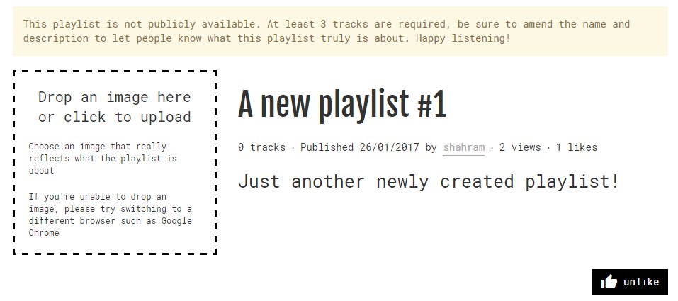
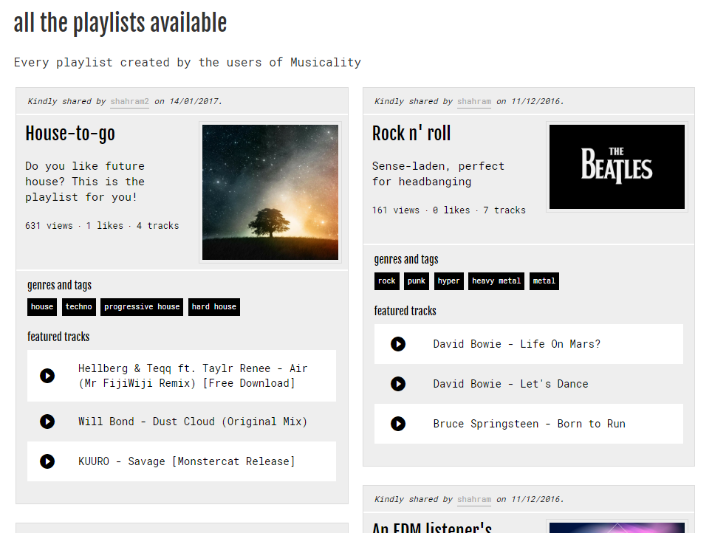
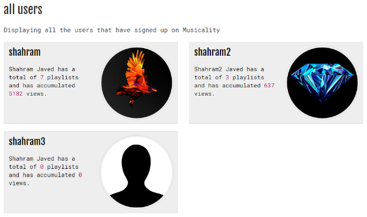
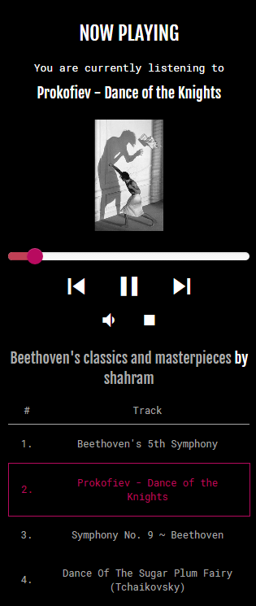
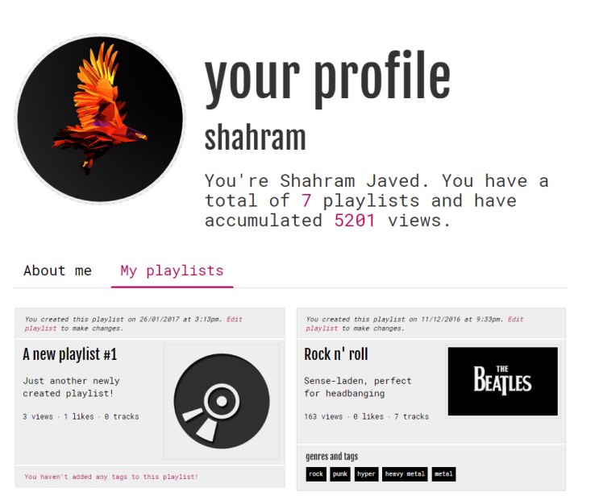

**The problem**

After using YouTube and SoundCloud as solely music services, I concluded that discovering new music is not always as easy as one would expect. Managing big libraries of music over long periods of time can become a hassle and sorting through your existing libraries to find a particular track is tedious. Creating a music service like Spotify was definitely not an option but rather combining existing services with the use of a middleman – Musicality – was the only feasible route I could take.

**The solution**

Musicality is essentially a viable alternative to existing music services such as Spotify or Rdio – to a certain extent. My service is based upon the premise that finding new music is becoming more and more difficult as time goes by. When I say this, I&#39;m referring to the fact that YouTube&#39;s recommendation algorithm can only reach certain depths, displaying related videos that may sometimes not be as accurate as one would hope.

I&#39;ve created this service in the attempt to outline what a free version to what Spotify inherently provides might look like in the real world. Spotify customers pay hundreds of pounds a year to access a service that allows them a music library that is easily accessible across many different devices. This exorbitant price tag can put a lot of users off and in quite a few cases, lead them to resort to applications like YouTube and SoundCloud to listen to their music. YouTube is perhaps the most popular platform to publish new music with record labels like Vevo uploading new music by top artists every single day. Likewise, SoundCloud allows smaller, often lesser-known artists to be given the chance to share their music with the world with the hope that they might one day become more popular.

I have decided to utilise YouTube as well as SoundCloud for my unified playback service as these sources have matured, are from large corporations indicating the likelihood of a longer lifespan and better support. The reason I&#39;ve put a lot of faith into these services is the mere fact that anyone – and I mean anyone – can upload music to these applications and have hundreds see their content, whereas Spotify may only allow established artists and record labels to do so on their service. This inevitably leads to an abundance of music at my disposal and subsequently, my end-users. Lesser-known artists that might not be able to upload to Spotify will now have the publicity they require to prosper in their field as my service will aid in their promotion. Besides the large music library from which you can create and share playlists, I&#39;ve built the user interface purely based on user experience and ease of use.

**My toolbox: languages, frameworks and design inspiration**

After much thought, I decided to use purely one language. In this case, it was JavaScript. A language powering a large portion of the web as we know it. I opted for node.js and Express for the server stack while AngularJS – a Google technology – as the front-end framework. All animations, user interface functionality etc. will be handled by this while node.js will handle the business logic such as complex database storage/querying, allowing users to create their own account and then be able to log in using those credentials, manage their playlists as well as storing links to media that will inevitably be played back by the user. 
I believe that in the modern era of the web, modern or minimalism is something that should be adopted and used more prominently. No one likes convoluted user interfaces that have too much going on the screen or those that aren’t very responsive. That is why I decided to go for a black and white colour scheme – two contrasting colours makes for easier accessibility, screen reading and all-in-all suits the atmosphere the platform is trying to provide.

**Usability of my product**

I interviewed some students to see whether they would use a service such as mine on a daily basis. The majority of those who participated in my survey found that my user interface is robust, effective in its purpose and generally a pleasure to use. Creating playlists was a breeze, not to mention how effortless it was to create an account said quite a few.
What I’ve noticed in a lot of popular websites is that when a user carries out an action e.g. post a comment on a user’s post, the change is not always seen in real-time. My service is very responsive, you will see all changes, and additions etc. done in real-time as you should on the modern web in today’s time. We have moved past the era of full page reloads and delayed responses, I believe user experience should be put first.

**Screenshots of select pages**

*New Playlist*

*Playlists*

*Users*

*Media Player*

*Profile*

